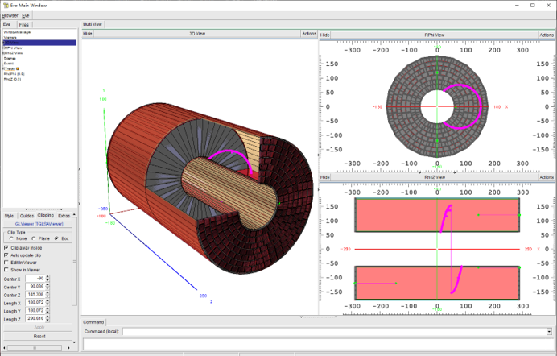

# TPCgeoViewer

## Description
A tool for CEPC_TPC geo visualization based on [`ROOT Event Dispaly`](https://root.cern/doc/master/group_tutorial_eve.html)

## Request
+ ROOT
+ CMake
+ Platform: Win10/11 + VS2022, Linux

## TPC Geometry overview


## How to Use?
1. Extract Gentle file (used by `ROOT Event Display`) from input geometry file (exported from DD4hep)
    ```C++
    geoEveViewer::ExtractGentleVolume(inputrootfile,gentlefile);
    ```
2. Show TPC Geometry at 3D/RPhi/RhoZ view
    ```C++
    geoEveViewer* g = new geoEveViewer(inputrootfile,gentlefile);
    g->MakeMultiViewer();
    ```
3. Shoot a straight track and get the material budget by given the start point, direction vector, verbose, materialbudget
    ```C++
    TVector3 p0(0.,0.,0.);
    TVector3 direct(0.,0.,1.);
    double xx;
    auto vecX0table = g->Start_Track(p0,p1,kTRUE,xx);//kTRUE, print detailed info of every step
    ```
4. Show a Gui Table to summarize info of every step  
    ```C++
    GuiTable::ShowXguiTable(vecX0table); 
    ```
5. Get X/X0 v.s. theta Hist
    ```C++
    auto hXoverX0 = g->GetXoverX0vsTheta();
    ```

---
class `MCMagB`,`RunManager` didn't used...


